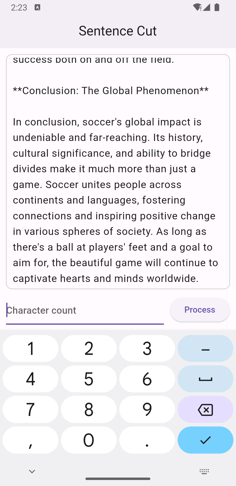
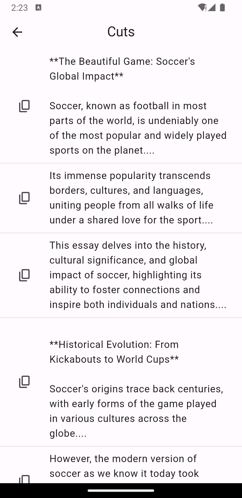

# Flutter Sentence Cutter App

Welcome to the **Flutter Sentence Cutter App** repository! This Flutter application is designed to take a long sentence as input and intelligently break it down into smaller chunks based on the desired character count. Whether you're working with limited character spaces or simply want to present content in a more digestible format, this app has you covered.




## Features

- **Input Sentence:** Enter a long sentence that you want to split into smaller parts.
- **Character Count:** Specify the maximum character count for each chunk.
- **Intelligent Chunking:** The app will intelligently break the sentence, maintaining word boundaries where possible.
- **Clear Visualization:** Visualize the resulting sentence chunks and see how your input is transformed.

## Installation

To run the Sentence Cutter App on your local machine, follow these steps:

1. Make sure you have Flutter and Dart installed. If not, you can download them from the official Flutter website.
2. Clone this repository to your local machine using the following command:
```bash
https://github.com/eijiotieno-official/flutter_sentence_cutter_app.git
```

## Contributions

Contributions to the Flutter Sentence Cutter App are welcome! If you have ideas for improvements, bug fixes, or additional features, feel free to submit issues and pull requests. Please make sure to follow the Flutter and Dart coding style guidelines.
